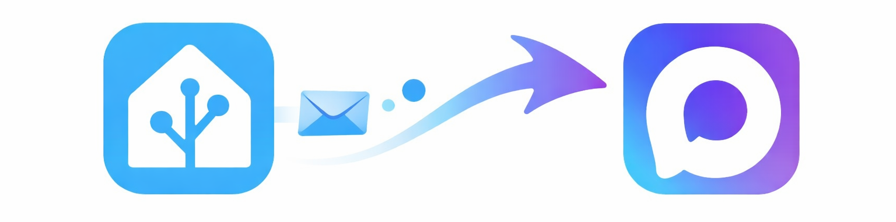

<p align="center">
  
</p>

# Max Notify — интеграция с мессенджером Max для Home Assistant

Отправка и приём сообщений в мессенджере **Max** через официальный API (platform-api.max.ru).

[](https://github.com/kai-zer-ru/max-notify-ha)

---

## Возможности

- **Отправка:** текст, фото, документы, видео в чаты Max (сервисы и сущности `notify`).
- **Приём:** входящие сообщения и нажатия inline-кнопок → событие `max_notify_received` для автоматизаций.
- **Кнопки:** настройка клавиатуры в интеграции, отправка сообщений с кнопками, реакция на нажатия по `callback_data`.
- Настройка через UI, без правки YAML (кроме автоматизаций).

---

## Требования

- Home Assistant (актуальная версия).
- Бот в Max и **токен** из раздела [Интеграция](https://dev.max.ru/docs-api) платформы Max для разработчиков.

---

## Установка

**HACS:** Интеграции → ⋮ → Добавить репозиторий → `https://github.com/kai-zer-ru/max-notify-ha`, категория «Интеграция». Установить **Max Notify**, перезапустить HA.

**Вручную:** скопировать папку `custom_components/max_notify` в `config/custom_components/`, перезапустить HA.

Добавить интеграцию: **Настройки** → **Устройства и службы** → **Добавить интеграцию** → **Max Notify**.

---

## Настройка

1. **Токен** — вставьте токен доступа бота (раздел «Интеграция» на [dev.max.ru](https://dev.max.ru/)). Интеграция проверит его через API.
2. **Формат сообщений** — Текст, Markdown или HTML (параметр `format` в [API сообщений](https://dev.max.ru/docs-api/methods/POST/messages)).
3. **Режим приёма** — только отправка, Long Polling или Webhook (см. раздел «Приём сообщений» ниже).
4. При Polling/Webhook: при необходимости укажите **секрет webhook**, затем настройте **кнопки клавиатуры** (добавить/редактировать/удалить).
5. **Добавить чат** — один ID получателя: **положительный** = личный чат (User ID), **отрицательный** = группа (Chat ID).

Дополнительные чаты: страница интеграции → ⋮ → **Добавить чат**. Изменить токен или формат: **шестерёнка** или ⋮ → **Перенастроить** (токен можно оставить пустым).

После сохранения появятся сущности `notify.max_...` и сервисы `max_notify.send_message`, `send_photo`, `send_document`, `send_video`.

---

## Приём сообщений

При режиме **Long Polling** или **Webhook** интеграция получает обновления от Max и генерирует событие **`max_notify_received`**.

**Режимы:**
- **Только отправка** — приём отключён.
- **Long Polling** — опрос API Max, доступ из интернета к HA не нужен.
- **Webhook** — Max шлёт запросы на URL вашего HA (нужен внешний URL, Nabu Casa или reverse proxy). В настройках отображается URL; опционально задаётся секрет (заголовок `X-Max-Bot-Api-Secret`).

### Данные события

В `event.data` доступны:

| Поле | Описание |
|------|----------|
| `update_type` | `message_created` (новое сообщение) или `message_callback` (нажатие кнопки) |
| `config_entry_id` | ID записи интеграции |
| `user_id`, `chat_id` | Отправитель и чат (у группы `chat_id` отрицательный) |
| `text` | Текст сообщения; при `message_callback` — текст сообщения с кнопками |
| `command` | Команда без `/`, если текст начинается с `/` (напр. `/start` → `start`) |
| `args` | Остаток текста после команды |
| `callback_data` | Payload нажатой кнопки (при `message_callback`) |
| `event_id` | Уникальный идентификатор нажатия (для дедупликации в автоматизациях) |

### Групповые чаты

Чтобы получать сообщения из **группы**:
1. Добавьте бота в группу в Max.
2. Назначьте бота **администратором** группы ([документация Max](https://dev.max.ru/docs-api/objects/Update)).
3. Добавьте чат в интеграции с **отрицательным** ID (как в событии).

Личный чат и группа различаются по `chat_id`: отрицательный — группа, положительный — личный. Для ответа в тот же чат: в группе передайте `config_entry_id` и `chat_id` из события; в личном — `config_entry_id` и `user_id`.

### Пример: ответ в тот же чат на команду

```yaml
trigger:
  - platform: event
    event_type: max_notify_received
    event_data:
      command: start
action:
  - choose:
      - conditions:
          - condition: template
            value_template: "{{ trigger.event.data.chat_id is defined and trigger.event.data.chat_id < 0 }}"
        sequence:
          - service: max_notify.send_message
            data:
              config_entry_id: "{{ trigger.event.data.config_entry_id }}"
              chat_id: "{{ trigger.event.data.chat_id }}"
              message: "Привет из группы!"
      - conditions: []
        default: true
        sequence:
          - service: max_notify.send_message
            data:
              config_entry_id: "{{ trigger.event.data.config_entry_id }}"
              user_id: "{{ trigger.event.data.user_id }}"
              message: "Привет в личку!"
```

### Пример: реакция на нажатие кнопки

```yaml
trigger:
  - platform: event
    event_type: max_notify_received
    event_data:
      update_type: message_callback
      callback_data: light_on
action:
  - service: light.turn_on
    target:
      entity_id: light.living_room
  - service: max_notify.send_message
    data:
      config_entry_id: "{{ trigger.event.data.config_entry_id }}"
      user_id: "{{ trigger.event.data.user_id }}"
      message: "Свет включён"
```

В автоматизациях используйте триггер «Событие» с типом `max_notify_received` и при необходимости фильтр по `command`, `callback_data`, `chat_id` или `config_entry_id`. Отладка: Инструменты разработчика → События → подписка на `max_notify_received`.

---

## Кнопки клавиатуры

**В настройках интеграции** (при режиме Polling/Webhook): добавляются, редактируются и удаляются кнопки (ряд, тип callback/message, подпись, payload). Они по умолчанию прикрепляются к каждому отправляемому сообщению (параметр `send_keyboard` сервиса).

**Payload** кнопки типа callback при нажатии приходит в событии в поле `callback_data` — используйте его в триггерах автоматизаций (например `light_on`, `light_off`).

**В сервисе** `max_notify.send_message` можно передать параметр **`buttons`** — сообщение уйдёт с указанной клавиатурой. Формат: список рядов, каждый ряд — список кнопок `{type: "callback"|"message", text: "Подпись", payload?: "..."}`. Нужны `config_entry_id` и `chat_id` или `user_id` (не `entity_id`).

Пример отправки с кнопками:

```yaml
service: max_notify.send_message
data:
  config_entry_id: "{{ trigger.event.data.config_entry_id }}"
  user_id: "{{ trigger.event.data.user_id }}"
  message: "Управление:"
  buttons:
    - - type: callback
        text: "Включить"
        payload: light_on
      - type: callback
        text: "Выключить"
        payload: light_off
```

---

## Сервисы

### max_notify.send_message

| Параметр | Описание |
|----------|----------|
| `message` | Текст (обязательно) |
| `title` | Заголовок |
| `entity_id` | Сущности notify Max Notify (или в «Дополнительно»: `config_entry_id` + `chat_id` / `user_id`) |
| `send_keyboard` | При `true` (по умолчанию) к сообщению прикрепляется клавиатура из настроек интеграции |
| `buttons` | Inline-кнопки под сообщением (список рядов кнопок); при использовании — `config_entry_id` и `chat_id`/`user_id` |

```yaml
service: max_notify.send_message
data:
  entity_id: notify.max_user_123
  message: "Текст"
  title: "Заголовок"
```

### max_notify.send_photo

| Параметр | Описание |
|----------|----------|
| `file` | Путь (`/config/...`, `/media/...`) или URL изображения |
| `caption` | Подпись |
| `entity_id` / доп. | Как у send_message |

### max_notify.send_document

Файл по пути или URL отправляется как документ. Параметры: `file`, `caption`, `entity_id` (или config_entry_id + chat_id/user_id).

### max_notify.send_video

Форматы: mp4, mov, webm, mkv. Параметры: `file`, `caption`, `entity_id` (или доп.).

Отправка через сущность: в сценариях и автоматизациях — действие **Уведомление** → выбор сущности Max Notify.

---

## Токен и ID

**Токен:** [Max для разработчиков](https://dev.max.ru/) → бот → **Интеграция** → получить токен.

**User ID и Chat ID:** бот [CHECK ID](https://max.ru/id222312277810_1_bot) в Max возвращает ID по пересланному сообщению. Либо API: `GET https://platform-api.max.ru/chats` с заголовком `Authorization: <токен>` ([документация API Max](https://dev.max.ru/docs-api)).

---

## Ссылки

- [Репозиторий](https://github.com/kai-zer-ru/max-notify-ha)
- [Документация API Max](https://dev.max.ru/docs-api)
- [Max для разработчиков](https://dev.max.ru/)
