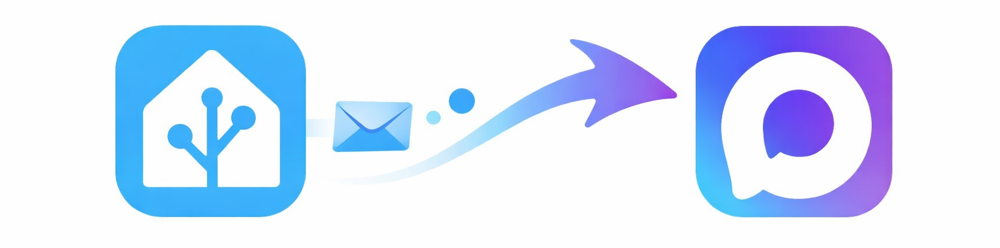

<p align="center">
  
</p>

# Max Notify — интеграция с мессенджером Max для Home Assistant

Отправка и приём сообщений в мессенджере **Max** через официальный API (platform-api.max.ru).

[](https://github.com/kai-zer-ru/max-notify-ha)

---

# 📣 Присоединяйтесь к сообществу

Следите за новостями, обновлениями и получайте помощь:

- **Канал в Telegram** — [@kai_zer_ru_ha](https://t.me/kai_zer_ru_ha)  
  
- **Канал в Max** — [kai_zer_ru_ha](https://max.ru/id251603503331_biz)

- **Канал в Dzen** - [kai_zer_ru](https://dzen.ru/kai_zer_ru)

---

# ⚠️ Важная информация

В данный момент регистрация на платформе разработчиков MAX доступна только индивидуальным предпринимателям и организациям. То есть юридическим лицам. Это ограничение самой платформы. К интеграции это отношения не имеет. Надеемся, что в ближайшем будущем эту процедуру упростят.

---

### 🔗 Поддержка `notify.a161.ru` (важно)

Интеграция поддерживает отдельный режим отправки через сервис `https://notify.a161.ru/` и бота `https://max.ru/id6162049515_1_bot`.

**Дисклеймер:**
- Автор этой интеграции **не несёт ответственности** за работу сервиса `notify.a161.ru` и бота `@id6162049515_1_bot`.
- Подключение и использование этого режима выполняется **на ваш страх и риск**.

**Технические ограничения режима `notify.a161.ru`:**
- Поддерживается **только отправка текстовых сообщений**.
- `user_id` в этом режиме считается привязанным к токену и фиксируется при первой настройке интеграции.
- Поддержка inline-кнопок (клавиатуры, `buttons`, `send_keyboard`) в этом режиме **не работает**.
- На текущий момент **не работают**: `send_photo`, `send_video`, `send_document`, `edit_message`, `delete_message`.
- При отправке сервис `notify.a161.ru` может вернуть **пустой HTTP-ответ без тела** (без JSON и без `message_id` в ответе).
- Режим приёма сообщений (Polling/Webhook), группы и прочие расширенные возможности официального API Max в этом режиме недоступны.


---
## ✨ Возможности

- **Отправка:** текст, фото, документы, видео в чаты Max (сервисы и сущности `notify`).
- **Приём:** входящие сообщения и нажатия inline-кнопок → событие `max_notify_received` для автоматизаций.
- **Кнопки:** настройка клавиатуры в интеграции, отправка сообщений с кнопками, реакция на нажатия по `callback_data`.
- Настройка через UI, без правки YAML (кроме автоматизаций).

> Для режима `notify.a161.ru`: гарантированно поддерживается только отправка текстовых сообщений. Остальные возможности ниже относятся к официальному API-домену `platform-api.max.ru`.

---

## 📋 Требования

> Этот раздел относится только к официальному API-домену `platform-api.max.ru`.

- Home Assistant (актуальная версия).
- Бот в Max и **токен** из раздела [Интеграция](https://business.max.ru/self/#/chat-bots) платформы Max для разработчиков.

Для режима `notify.a161.ru` вместо этого нужны `user_id` и токен, выданные сервисным ботом `@id6162049515_1_bot`.

---

## 🔧 Установка

**HACS:** Интеграции → ⋮ → Добавить репозиторий → `https://github.com/kai-zer-ru/max-notify-ha`, категория «Интеграция». Установить **Max Notify**, перезапустить HA.

**Вручную:** скопировать папку `custom_components/max_notify` в `config/custom_components/`, перезапустить HA.

Добавить интеграцию: **Настройки** → **Устройства и службы** → **Добавить интеграцию** → **Max Notify**.

---

## ⚙️ Настройка

### 1) 🌐 Официальный API (`platform-api.max.ru`)

1. **Тип интеграции** — выберите «Official Max API (platform-api.max.ru)».
2. **Токен** — вставьте токен доступа бота (раздел «Интеграция» на [business.max.ru](https://business.max.ru/)). Интеграция проверит его через API.
3. **Формат сообщений** — Текст, Markdown или HTML (параметр `format` в [API сообщений](https://dev.max.ru/docs-api/methods/POST/messages)).
4. **Режим приёма** — только отправка, Long Polling или Webhook (см. раздел «Приём сообщений» ниже).
5. При Polling/Webhook: при необходимости укажите **секрет webhook**, затем настройте **кнопки клавиатуры** (добавить/редактировать/удалить).
6. **Добавить чат** — один ID получателя: **положительный** = личный чат (User ID), **отрицательный** = группа (Chat ID).

Дополнительные чаты: страница интеграции → ⋮ → **Добавить чат**. Изменить токен или формат: **шестерёнка** или ⋮ → **Перенастроить** (токен можно оставить пустым).

После сохранения появятся сущности `notify.max_...` и сервисы `max_notify.send_message`, `send_photo`, `send_document`, `send_video`.

### 2) 🚪 Сервис `notify.a161.ru`

1. **Тип интеграции** — выберите «notify.a161.ru (text-only self notifications)».
2. На шаге с инструкцией перейдите на [notify.a161.ru](https://notify.a161.ru/) и получите `user_id` и токен у сервисного бота.
3. Введите токен сервиса (`36` символов) и формат сообщений.
4. Добавьте получателя: только **положительный** `recipient_id` (`user_id`). Этот `user_id` фиксируется и далее не редактируется через настройки интеграции.

Для этого режима доступна только отправка текста (`max_notify.send_message` без медиа/редактирования/удаления).
Поддержка кнопок (`buttons`, `send_keyboard`, inline-клавиатура) для `notify.a161.ru` не работает.
Если нужно сменить `user_id`, рекомендуется удалить и заново добавить интеграцию с новым токеном/`user_id`.

---

## 📥 Приём сообщений

> Этот раздел относится только к официальному API-домену `platform-api.max.ru`.

При режиме **Long Polling** или **Webhook** интеграция получает обновления от Max и генерирует событие **`max_notify_received`**.

**Режимы:**
- **Только отправка** — приём отключён.
- **Long Polling** — опрос API Max, доступ из интернета к HA не нужен.
- **Webhook** — Max шлёт запросы на URL вашего HA (нужен внешний URL, Nabu Casa или reverse proxy). В настройках отображается URL; опционально задаётся секрет (заголовок `X-Max-Bot-Api-Secret`).

### 📦 Данные события

В `event.data` доступны:

| Поле | Описание |
|------|----------|
| `update_type` | `message_created` (новое сообщение) или `message_callback` (нажатие кнопки) |
| `config_entry_id` | ID записи интеграции |
| `user_id`, `chat_id` | Отправитель и чат (у группы `chat_id` отрицательный) |
| `recipient_id` | Универсальный ID получателя: **> 0** — личный чат (User ID), **< 0** — группа (Chat ID) |
| `text` | Текст сообщения; при `message_callback` — текст сообщения с кнопками |
| `command` | Команда без `/`, если текст начинается с `/` (напр. `/start` → `start`), либо payload нажатой кнопки |
| `args` | Остаток текста после команды |
| `callback_data` | Payload нажатой кнопки (при `message_callback`) |
| `event_id` | Уникальный идентификатор нажатия (для дедупликации в автоматизациях) |

Для автоматизаций рекомендуется использовать **`recipient_id`** (и в триггерах, и в сервисах) — это тот же ID, который вы указываете в «Добавить чат». Поля `chat_id` и `user_id` оставлены для совместимости и низкоуровневых сценариев.

### 🧩 Групповые чаты

Чтобы получать сообщения из **группы**:
1. Добавьте бота в группу в Max.
2. Назначьте бота **администратором** группы ([документация Max](https://dev.max.ru/docs-api/objects/Update)).
3. Добавьте чат в интеграции с **отрицательным** ID (как в событии).

Личный чат и группа различаются по `recipient_id`: **отрицательный** — группа (Chat ID), **положительный** — личный чат (User ID).

### 💬 Пример: ответ в тот же чат на команду

```yaml
trigger:
  - platform: event
    event_type: max_notify_received
    event_data:
      command: start

action:
  - service: max_notify.send_message
    data:
      config_entry_id: "{{ trigger.event.data.config_entry_id }}"
      recipient_id: "{{ trigger.event.data.recipient_id }}"
      message: "Привет!"
      send_keyboard: true
```

### 🔘 Пример: реакция на нажатие кнопки

```yaml
trigger:
  - platform: event
    event_type: max_notify_received
    event_data:
      update_type: message_callback
      callback_data: light_on
action:
  - service: light.turn_on
    target:
      entity_id: light.living_room
  - service: max_notify.send_message
    data:
      config_entry_id: "{{ trigger.event.data.config_entry_id }}"
      recipient_id: "{{ trigger.event.data.recipient_id }}"
      message: "Свет включён"
```

В автоматизациях используйте триггер «Событие» с типом `max_notify_received` и при необходимости фильтр по `command`, `callback_data`, `chat_id` или `config_entry_id`. Отладка: Инструменты разработчика → События → подписка на `max_notify_received`.

---

## 🎛️ Кнопки клавиатуры

> Этот раздел относится только к официальному API-домену `platform-api.max.ru`.

**В настройках интеграции** (при режиме Polling/Webhook): добавляются, редактируются и удаляются кнопки (ряд, тип callback/message, подпись, payload). Они по умолчанию прикрепляются к каждому отправляемому сообщению (параметр `send_keyboard` сервиса).

**Payload** кнопки типа callback при нажатии приходит в событии в поле `callback_data` — используйте его в триггерах автоматизаций (например `light_on`, `light_off`).

**В сервисе** `max_notify.send_message` можно передать параметр **`buttons`** — сообщение уйдёт с указанной клавиатурой. Формат: список рядов, каждый ряд — список кнопок `{type: "callback"|"message", text: "Подпись", payload?: "..."}`. Нужны `config_entry_id` и `chat_id` или `user_id` (не `entity_id`).

Пример отправки с кнопками:

```yaml
service: max_notify.send_message
data:
  config_entry_id: "{{ trigger.event.data.config_entry_id }}"
  user_id: "{{ trigger.event.data.user_id }}"
  message: "Управление:"
  buttons:
    - - type: callback
        text: "Включить"
        payload: light_on
      - type: callback
        text: "Выключить"
        payload: light_off
```

---

## 🛠️ Сервисы

Полный набор готовых YAML-примеров для всех сервисов (вручную и из `max_notify_received`) вынесен в отдельный файл:  
[`AUTOMATIONS.md`](AUTOMATIONS.md)

### 📨 max_notify.send_message

| Параметр | Описание |
|----------|----------|
| `message` | Текст (обязательно) |
| `title` | Заголовок |
| `entity_id` | Сущности notify Max Notify (или в «Дополнительно»: `config_entry_id` + `recipient_id`) |
| `recipient_id` | Универсальный ID получателя: положительный — User ID (личный), отрицательный — Chat ID (группа) |
| `send_keyboard` | При `true` (по умолчанию) к сообщению прикрепляется клавиатура из настроек интеграции |
| `buttons` | Дополнительные inline-кнопки (список рядов). Объединяются с настроенной клавиатурой при `send_keyboard=true`; можно указывать вместе с `entity_id` или `config_entry_id` + `recipient_id` |

> Примечание: отправка текста доступна и в режиме `notify.a161.ru`, но параметры клавиатуры/кнопок относятся к официальному API-домену `platform-api.max.ru`.

```yaml
service: max_notify.send_message
data:
  entity_id: notify.max_user_123
  message: "Текст"
  title: "Заголовок"
```

### 🖼️ max_notify.send_photo

> Этот сервис относится только к официальному API-домену `platform-api.max.ru`.

| Параметр | Описание |
|----------|----------|
| `file` | Путь (`/config/...`, `/media/...`) или URL изображения |
| `caption` | Подпись |
| `entity_id` / доп. | Как у send_message |
| `count_requests` | Число попыток POST при ожидании обработки вложения (`attachment.not.ready`). Увеличьте для больших файлов (по умолчанию — 4). |

### 📎 max_notify.send_document

> Этот сервис относится только к официальному API-домену `platform-api.max.ru`.

Файл по пути или URL отправляется как документ. Параметры: `file`, `caption`, `entity_id` (или config_entry_id + chat_id/user_id), **`count_requests`** — число попыток при ожидании обработки вложения (для больших файлов).

### 🎥 max_notify.send_video

> Этот сервис относится только к официальному API-домену `platform-api.max.ru`.

Форматы: mp4, mov, webm, mkv. Параметры: `file`, `caption`, `entity_id` (или доп.), **`count_requests`** — число попыток при ожидании обработки вложения (для больших видео).

Отправка через сущность: в сценариях и автоматизациях — действие **Уведомление** → выбор сущности Max Notify.

### 🗑️ max_notify.delete_message

> Этот сервис относится только к официальному API-домену `platform-api.max.ru`.

Удаляет сообщение по ID (только сообщения младше 24 часов). `message_id` доступен в событии `max_notify_received`.

| Параметр | Описание |
|----------|----------|
| `message_id` | ID сообщения (обязательно), напр. `{{ trigger.event.data.message_id }}` |
| `config_entry_id` | Интеграция (если несколько) |

### ✏️ max_notify.edit_message

> Этот сервис относится только к официальному API-домену `platform-api.max.ru`.

Редактирует текст и/или кнопки сообщения (только младше 24 часов).

| Параметр | Описание |
|----------|----------|
| `message_id` | ID сообщения (обязательно) |
| `text` | Новый текст (опционально) |
| `buttons` | Inline-клавиатура: список рядов `{type, text, payload?}`; заменяет текущие кнопки |
| `remove_buttons` | Удалить все кнопки |
| `format` | Формат текста: text, markdown, html |
| `config_entry_id` | Интеграция (если несколько) |

```yaml
# Удалить сообщение
service: max_notify.delete_message
data:
  message_id: "{{ trigger.event.data.message_id }}"

# Редактировать текст
service: max_notify.edit_message
data:
  message_id: "{{ trigger.event.data.message_id }}"
  text: "Обновлённый текст"
```
## 🐞 Включение режима отладки

Для того, что бы в логи начала отправляться отладочная информация нужно в файл `configuration.yaml` добавить строки:

```
logger:
  default: warning
  logs:
    custom_components.max_notify: debug
```
Затем нужно перезагрузить HomeAssistant и перейтии в раздел **Настройки -> Система -> Журнал сервера ->** справа сверху нажать троеточие и выбрать "Показать исходный журнал"

---

## 🔑 Токен и ID

**Токен:** [Max для разработчиков](https://dev.max.ru/) → бот → **Интеграция** → получить токен.

**User ID и Chat ID:** бот [CHECK ID](https://max.ru/id222312277810_1_bot) в Max возвращает ID по пересланному сообщению. Либо через API: `GET https://platform-api.max.ru/chats` с заголовком `Authorization: <токен>` ([документация API Max](https://dev.max.ru/docs-api)).

---

## 🔗 Ссылки

- [Репозиторий](https://github.com/kai-zer-ru/max-notify-ha)
- [Документация API Max](https://dev.max.ru/docs-api)
- [Max для разработчиков](https://dev.max.ru/)
- [Канал в Telegram](https://t.me/kai_zer_ru_ha)
- [Канал в Max](https://max.ru/id251603503331_biz)

