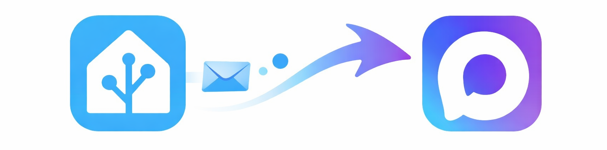

<p align="center">
  
</p>

# MaxNotify для Home Assistant

**MaxNotify** подключает мессенджер **Max** к Home Assistant: можно отправлять сообщения, фото, файлы и видео в чаты и (по желанию) реагировать на входящие сообщения и нажатия кнопок в сценариях. Настройка выполняется через интерфейс Home Assistant, без правки конфигурационных файлов для самой интеграции.

Интеграция умеет работать **двумя способами**: с **официальным API** платформы Max и через сервис **notify.a161.ru** (упрощённый вариант для тех, кто им пользуется). Оба варианта настраиваются в мастере при добавлении записи.

**Поддерживается Home Assistant** не ниже **2026.2.0** (более старые выпуски могут работать некорректно).

---

## Содержание

- [Сообщество и поддержка](#сообщество-и-поддержка)
- [Важно знать про Max и про notify.a161.ru](#важно-знать)
- [Поведение уведомлений и каналы](#поведение-уведомлений-и-каналы)
- [Что умеет интеграция](#что-умеет)
- [Что понадобится заранее](#что-понадобится)
- [Установка](#установка)
- [Сертификаты Минцифры (platform-api2.max.ru)](#сертификаты-минцифры-platform-api2maxru)
- [Первичная настройка](#первичная-настройка)
- [Приём сообщений и сценарии](#приём-сообщений)
- [Кнопки под сообщением](#кнопки)
- [Действия Home Assistant (сервисы)](#действия-home-assistant)
- [Подробные примеры автоматизаций](#подробные-примеры-автоматизаций)
- [Если что-то не работает: журнал](#если-что-то-не-работает-журнал)
- [Где взять токен и ID](#где-взять-токен-и-id)
- [Для разработчиков](#для-разработчиков)
- [Полезные ссылки](#полезные-ссылки)

[](https://github.com/hacs/integration)
[](https://github.com/kai-zer-ru/max-notify-ha)
[](https://www.tbank.ru/rm/r_wKLcbFgjYa.ncgWMwrHSA/vyQvd5941/)

---

## Сообщество и поддержка

Новости, обновления и помощь по теме:

- **Telegram** — [@kai_zer_ru_ha](https://t.me/kai_zer_ru_ha)
- **Max** — [kai_zer_ru_ha](https://max.ru/channel_kai_zer_ru_ha)
- **Дзен** — [kai_zer_ru_ha](https://dzen.ru/kai_zer_ru_ha)
- **VK** — [kai_zer_ru_ha](https://vk.com/kai_zer_ru_ha)
- **Обсуждение** - [Чат в Max](https://max.ru/join/KoCsTSA3VGOCiIFdSAW0myVJEwXZi-rt9fTfGxdgk6A)
- **Поддержка автора** - [Мой сайт](https://kai-zer.ru/support)

---

## Важно знать

### Регистрация бота в Max

Сейчас регистрация разработчика и выпуск бота на платформе Max ориентированы на **ИП и организации**. Это правила самой платформы, а не интеграции. Для работы через **официальный API** вам нужен бот и токен из кабинета разработчика.

### Сервис notify.a161.ru

Интеграция **может** работать через прокси [notify.a161.ru](https://notify.a161.ru/) и бота в Max — те же идеи (отправка, приём, кнопки), но с **ограничениями этого сервиса** и без ответственности автора MaxNotify за стабильность чужого сайта. Подключение такого режима — **на ваше усмотрение и риск**.

Кратко, как этот режим устроен в MaxNotify (**это единственное место, где перечислены все отличия**; дальше по тексту — только отсылки сюда, без повторов):

- **Чаты:** поддерживаются **личные** (положительный ID) и **групповые и каналы** (отрицательный ID), как в мессенджере Max: отправка и приём — если это позволяет [сервис](https://notify.a161.ru/). Несколько получателей к одной записи — через **Добавить чат** (как у официального API). Другой токен или полностью отдельная связка настроек — **отдельная** запись MaxNotify.
- **Slash-команды:** добавить команды бота через API Max в этом режиме нельзя; входящие сообщения вида `/команда` всё равно обрабатываются — в событии **`max_notify_received`** поле **`command`** без ведущего `/` (как при работе через официальный API).
- Приём входящих — **WebSocket** (по умолчанию, если сервер разрешил) или **Long Polling**. Короткий опрос раз в несколько секунд больше не используется. WebHook в этом режиме нет.
- Перед отправкой файлов интеграция проверяет размер **до 10 МБ** на файл.
- Если выбран **Long Polling** и долго не было ни входящих сообщений, ни исходящих **с кнопками**, интеграция может **сама переключить приём на «только отправка»** (чтобы снова слушать чат, включите приём в настройках записи). Для **WebSocket** такого автоотключения нет.
- Между исходящими запросами к одной записи выдерживается пауза **около 1 секунды**.
- **Удаление сообщений:** по **`message_id`** или списку **`message_ids`** — поддерживается. **Удаление по дате**, по **интервалу «начало / конец периода для поиска»** и действие **«удалить последнее исходящее»** для notify.a161.ru **не поддерживаются** (эти режимы есть только у **официального API**). При вызове недоступной операции Home Assistant покажет **переведённую ошибку**, запрос к сервису уходит не будет.

Шаги мастера — в разделе [Первичная настройка → notify.a161.ru](#notifya161ru).

### Токен

Токен вы получаете у выбранного способа подключения (официальный кабинет Max или бот notify.a161.ru). В описании интеграции считается, что это **долгоживущий** токен: отдельные сценарии смены пароля и срока жизни здесь не расписываются.

---

## Что умеет

- **Отправка** текста, фото, документов и видео в Max через **службу MaxNotify** (действия `max_notify.send_message`, `send_photo`, `send_document`, `send_video` и т.д. в сценариях или вручную в **Инструментах разработчика**).
- **Медиа по ссылке:** если в действии указан `http`/`https`, файл **один раз** скачивается во временную папку Home Assistant и уже с диска уходит в Max. При рассылке в несколько чатов повторного скачивания той же ссылки нет; после отправки временный файл удаляется. Путь к файлу на диске HA по-прежнему можно указать напрямую.
- **Одно сообщение с несколькими вложениями** — в интерфейсе действий можно передать список файлов; на стороне интеграции действует общий лимит платформы (**до 12 вложений на сообщение**, включая inline-клавиатуру), как у официального API Max.
- **Приём** (если включён): новые сообщения и нажатия кнопок попадают в Home Assistant как событие **`max_notify_received`** — на него можно повесить сценарии.
- **Сообщения вида `/команда` (slash):** из текста входящего сообщения в событии заполняется поле **`command`** (без ведущего `/`), плюс **`args`** — остаток строки; так можно строить сценарии на команды в чате. Для записи с **официальным API** в настройках интеграции дополнительно можно задать список slash-команд бота и **синхронизировать** его с платформой Max. У **notify.a161.ru** синхронизации команд с бэкендом Max нет, но разбор `/команда` в пришедшем тексте при включённом приёме сохраняется.
- **Кнопки** под сообщением: задаются в настройках записи и/или в действии отправки; по нажатию можно запускать автоматизации.
- **Рассылка одним действием** всем добавленным чатам во **всех** записях MaxNotify — действие **`max_notify.send_text_to_all`**.
- Настройка через **Настройки → Устройства и службы**; YAML нужен только если вы сами пишете сценарии.

У **официального API** есть **Long Polling** и **WebHook**; у **notify.a161.ru** входящие идут по **WebSocket** или **Long Polling**. **Группы и каналы** (отрицательный ID чата) поддерживаются в обоих типах подключения в рамках возможностей платформы; остальные ограничения notify.a161.ru — в разделе [Сервис notify.a161.ru](#сервис-notifya161ru).

---

## Поведение уведомлений и каналы

### Каналы

Отправка в **канал** настраивается так же, как в **группу**: у канала в Max **отрицательный** идентификатор чата — по тому же принципу, что и у группы. В MaxNotify отдельного режима «канал» не требуется: добавьте получателя с этим ID через **Добавить чат**, как для группы. Дополнительных параметров интеграции для канала нет; на стороне Max у бота должны быть **права администратора** в канале (иначе отправка или приём могут работать некорректно — аналогично группам).

### Уведомления (push) на разных клиентах

Замечено при тестах (зависит от версии клиента Max и политики платформы, **не** от Home Assistant):

- При отправке в **личный чат с ботом** уведомления показывают **все клиенты** Max, даже если отправлять с **`notify: false`**.
- При отправке в **группу или канал** с **`notify: false`** веб-клиент и десктопное приложение всё равно могут показать уведомление, а мобильное приложение уведомление не показывает. Сообщение при этом доставляется и видно в ленте чата.

Имеется в виду именно **системное уведомление / push** клиента Max; доставка сообщения в чат через API при этом не гарантирует одинаковое поведение уведомлений на всех платформах.

---

## Что понадобится

- Установленный Home Assistant не ниже **2026.2.0**.
- Для **официального API**: бот в Max и **токен** из раздела интеграции (например [business.max.ru](https://business.max.ru/self/#/chat-bots) / документация разработчика).
- Для **notify.a161.ru**: **user_id** и **токен** (36 символов), как выдаёт сервис [notify.a161.ru](https://notify.a161.ru/).

---

## Установка

### Через HACS (рекомендуется)

[](https://my.home-assistant.io/redirect/hacs_repository/?owner=kai-zer-ru&repository=max-notify-ha&category=integration)

Если кнопка не сработала: **HACS** → **Интеграции** → вверху списка откройте меню (**⋯**) → **Пользовательские репозитории** → URL `https://github.com/kai-zer-ru/max-notify-ha`, категория **Интеграция**. Установите **MaxNotify** и **перезапустите** Home Assistant.

### Вручную

Скопируйте папку `custom_components/max_notify` из этого репозитория в каталог `config/custom_components/` вашего Home Assistant и перезапустите систему.

После установки: **Настройки** → **Устройства и службы** → **Добавить интеграцию** → найдите **MaxNotify**.

---

## Сертификаты Минцифры (platform-api2.max.ru)

Официальный API Max с **июля 2026** работает на **`platform-api2.max.ru`** с TLS-сертификатами **НУЦ Минцифры**. Если Home Assistant не доверяет этим CA, интеграция не сможет проверить токен и отправлять сообщения.

**Порядок действий:** сначала добавьте сертификаты и перезапустите Home Assistant, убедитесь, что HTTPS к новому API проходит без ошибки SSL — **и только потом** обновляйте MaxNotify до **2.1.0+**. Иначе интеграция с официальным API временно перестанет работать.

Пошаговые инструкции для **HAOS, Supervised, Docker, Core** и других способов установки — в **[docs/RUSSIAN_TRUSTED_CA.md](docs/RUSSIAN_TRUSTED_CA.md)**.

Кратко: скачайте [корневой](https://gu-st.ru/content/lending/russian_trusted_root_ca_pem.crt) и [выпускающий](https://gu-st.ru/content/lending/russian_trusted_sub_ca_pem.crt) сертификаты; для HAOS и Docker удобнее всего интеграция **[Additional CA](https://github.com/Athozs/hass-additional-ca)** — настройте её **до** обновления MaxNotify.

> **После любого обновления Home Assistant Core** (с любой версии на любую) интеграция **Additional CA** снова копирует CA в контейнер. Пока SSL Context ещё без этих сертификатов, MaxNotify к официальному API не подключится (`CERTIFICATE_VERIFY_FAILED`). Additional CA при этом пишет в лог / показывает уведомление вида: *CA `russian_trusted_root_ca_pem.crt` / `russian_trusted_sub_ca_pem.crt` … is missing in SSL Context. Home Assistant needs to be restarted.* Сделайте **ещё одну** перезагрузку (**Настройки → Система → Перезагрузка**) — и только после неё проверяйте отправку в Max.

---

## Первичная настройка

При добавлении записи сначала выберите **тип подключения** в списке.

### Официальный API Max (platform-api2.max.ru)

> **До 19 июля 2026** платформа Max переводит API с `platform-api.max.ru` на **`platform-api2.max.ru`**. В MaxNotify **2.1.0+** уже используется новый адрес. **Сначала** добавьте сертификаты **НУЦ Минцифры** (удобнее через [Additional CA](https://github.com/Athozs/hass-additional-ca)), **затем** обновляйте интеграцию — иначе до настройки CA возможна ошибка SSL (`CERTIFICATE_VERIFY_FAILED`). Подробно: **[docs/RUSSIAN_TRUSTED_CA.md](docs/RUSSIAN_TRUSTED_CA.md)**.

1. Укажите **токен** бота — интеграция проверит его через сеть.
2. Выберите **формат текста**: обычный текст, Markdown или HTML (как позволяет API Max).
3. Выберите **режим приёма**:
   - **Только отправка** — входящие сообщения не обрабатываются.
   - **Длинный опрос (Long Polling)** — Home Assistant сам опрашивает сервер Max, **внешний адрес не нужен**.
   - **WebHook** — сервер Max вызывает **URL вебхука** вашего Home Assistant по **HTTPS** (входящие запросы к интеграции). Нужен **доступный из интернета** адрес (не только «домашний» `http://192.168.…`). Его задают в **Настройки → Система → Сеть**; часто используют облачный доступ Home Assistant или обратный прокси с сертификатом. В карточке интеграции показывается адрес вебхука; при желании задаётся **секрет** (проверка заголовка запроса).
4. Если включён приём не «только отправка», можно настроить **кнопки** клавиатуры (ряды, подписи, ссылка или «callback» для сценариев).
5. Добавьте **чат**: укажите номер получателя. **Положительное число** — личный диалог, **отрицательное** — группа или канал. Дополнительные чаты добавляются через меню записи (**Добавить чат**).

Позже токен и формат можно изменить в **Перенастроить**; список чатов — в настройках записи.

### notify.a161.ru

1. Получите на [notify.a161.ru](https://notify.a161.ru/) **user_id** и **токен** (36 символов).
2. Введите токен, формат сообщений и режим: **только отправка**, **WebSocket** (по умолчанию) или **Long Polling**. Если токен неактивен, приём не подключается.
3. Для Long Polling интервал опроса берётся **с сервера** (его не выбирают); можно задать **limit** (сколько событий за раз). Срок автоотключения тоже задаёт сервер и действует только для Long Polling. Правило переключения на «только отправка» — в [блоке про сервис](#сервис-notifya161ru).
4. Укажите ID получателя: **положительный** — личный чат, **отрицательный** — группа или канал (как у официального API). Дополнительные чаты — **Добавить чат** в карточке записи. Чтобы полностью сменить токен или «основную» связку, используйте **Перенастроить** или новую запись.

---

## Приём сообщений

Когда приём включён, Home Assistant получает событие **`max_notify_received`**. Его можно использовать в **Сценариях** с триггером **Событие**.

Основные поля (для ответа в тот же чат удобны **`config_entry_id`** и **`recipient_id`**):

| Поле | Зачем нужно |
|------|-------------|
| `update_type` | Тип: новое сообщение или нажатие кнопки |
| `config_entry_id` | Какая запись MaxNotify |
| `recipient_id` | Куда отвечать (**тот же номер**, что при добавлении чата): положительный — личный чат, отрицательный — группа или канал |
| `text` | Текст сообщения |
| `command` | Если сообщение похоже на команду (например `/start`) |
| `callback_data` | Данные нажатой кнопки |
| `message_id` | Номер сообщения (удобно для удаления или правки) |
| `event_id` | Уникальный ключ события (в т.ч. чтобы не сработать дважды) |

Дополнительно в событии могут быть поля вроде `user_id` и `chat_id` в формате API Max; для новых сценариев ориентируйтесь на **`recipient_id`**.

**Официальный API:** пока у бота активна подписка **WebHook**, **Long Polling** со стороны Max недоступен — в интерфейсе это учтено: сначала переключите режим, если нужно сменить способ приёма. Несколько записей с **одним и тем же** токеном не могут одновременно конфликтовать (например WebHook в одной и Long Polling в другой) — мастер настройки это блокирует.

На стороне платформы Max для **long polling** действуют ограничения (в т.ч. не более **2 запросов в секунду** к очереди обновлений, таймаут long poll **30 с**, размер выборки до **100** событий; подробности — в [документации подписок](https://dev.max.ru/docs-api/methods/POST/subscriptions)). Интеграция выдерживает паузу между запросами long polling и использует согласованный таймаут; для стабильной работы в продакшене по-прежнему рекомендуется **WebHook**, если у Home Assistant есть **публичный HTTPS** (см. [Сеть](https://www.home-assistant.io/docs/configuration/basic/) в документации HA). Переключение на WebHook **не ломает** существующие сценарии на событие **`max_notify_received`**, если внешний URL корректно указан в настройках системы.

**Если пропал внешний HTTPS** для WebHook: при загрузке интеграция может **снять подписку** в Max и перевести запись в безопасный режим, а в Home Assistant появится **заметка о проблеме** с подсказкой проверить сеть.

**notify.a161.ru:** входящие только через **Polling**; остальные ограничения — в [блоке про сервис](#сервис-notifya161ru).

**Группы и каналы (официальный API и notify.a161.ru):** бота добавляют в группу или канал и по правилам Max выдают нужные права (часто **администратор**), иначе события или отправка могут работать неполно. ID группы и канала — **отрицательный** `recipient_id` (подробнее — [Поведение уведомлений и каналы](#поведение-уведомлений-и-каналы)). Для notify.a161.ru дополнительные нюансы — [в блоке про сервис](#сервис-notifya161ru).

---

## Кнопки

- В **настройках записи** задаётся постоянная клавиатура (если включён приём не «только отправка» — для официального API это Long Polling или WebHook, для notify.a161 — Polling).
- В **действии отправки сообщения** можно добавить свои кнопки или отключить прикрепление сохранённой клавиатуры.
- Тип **ссылка** открывает сайт; адрес должен начинаться с `http://` или `https://`.
- Для кнопок «callback» в сценарии фильтруйте событие по **`callback_data`**.
- Как `send_keyboard` и `buttons` сочетаются в действиях — в **[ACTIONS.md](ACTIONS.md#клавиатура)**.

---

## Действия Home Assistant

Все действия начинаются с **`max_notify.`** (в интерфейсе — в списке действий службы MaxNotify).

Кратко:

| Действие | Назначение |
|----------|------------|
| **send_message** | Текст (и заголовок) в выбранный чат или несколько. |
| **send_text_to_all** | Тот же текст во все чаты всех записей MaxNotify. |
| **send_photo** / **send_document** / **send_video** | Медиа с диска HA или по ссылке; у фото и видео можно несколько файлов за раз. |
| **delete_message** | Удаление по ID, списку ID, дате или интервалу. |
| **delete_last_outgoing_message** | Последнее исходящее бота в **группе** (только официальный API). |
| **edit_message** | Правка текста и/или кнопок. |

Полное описание **каждого параметра** (цель, `format`, `notify`, клавиатура, медиа по URL, режимы удаления, отличия официального API и notify.a161.ru) — в **[ACTIONS.md](ACTIONS.md)**.

---

## Подробные примеры автоматизаций

Готовые фрагменты YAML (ответ на команду, нажатие кнопки, вызовы действий) — в **[AUTOMATIONS.md](AUTOMATIONS.md)**. Справочник параметров действий — в **[ACTIONS.md](ACTIONS.md)**.

---

## Если что-то не работает: журнал

Чтобы в журнале появлялись подробные сообщения интеграции, в `configuration.yaml` можно добавить:

```yaml
logger:
  default: warning
  logs:
    custom_components.max_notify: debug
```

Перезагрузите Home Assistant и откройте **Настройки → Система → Журнал**; при необходимости используйте просмотр полного журнала из меню журнала.

---

## Где взять токен и ID

- **Токен официального бота:** кабинет разработчика Max → ваш бот → раздел про интеграцию / API.
- **User ID и Chat ID:** например бот [CHECK ID](https://max.ru/id222312277810_1_bot) в Max (по пересланному сообщению). Список чатов через `GET /chats` с июня 2026 **недоступен** — `chat_id` группы/канала берут из событий (`bot_added`, `message_created` и т.п.) при WebHook ([POST /subscriptions](https://dev.max.ru/docs-api/methods/POST/subscriptions)) или Long Polling ([GET /updates](https://dev.max.ru/docs-api/methods/GET/updates)), либо из поля `chat_id` / `recipient_id` в событии Home Assistant `max_notify_received`. Подробнее — [документация Max](https://dev.max.ru/docs-api).

---

## Для разработчиков

Описание данных от операторов API и оформление изменений в репозитории: **[docs/README.md](docs/README.md)**.

Способности бэкенда по типу интеграции задаются в **`IntegrationCapabilities`** (см. **[docs/PROVIDER_SPEC.md](docs/PROVIDER_SPEC.md)**), в том числе:

- **`supports_delete_message`** — удаление по известному `message_id`;
- **`supports_delete_message_by_period`** — поиск по дате/интервалу и удаление найденных сообщений (по одному HTTP DELETE на сообщение);
- **`supports_delete_last_outgoing_message`** — служба «последнее исходящее».

Для **notify.a161.ru** последние два флага выключены.

**Сенсоры ID сообщений:** при появлении нескольких чатов на запись идентификаторы сообщений привязаны к чату; старые сенсоры с прежним `unique_id` могут остаться в системе помеченными как устаревшие — см. журнал и карточку устройства.

---

## Полезные ссылки

- [Сертификаты НУЦ Минцифры для API Max](docs/RUSSIAN_TRUSTED_CA.md)
- [Документация API Max](https://dev.max.ru/docs-api)
- [Портал разработчика Max](https://dev.max.ru/)
- [Канал в Telegram](https://t.me/kai_zer_ru_ha)
- [Канал в Max](https://max.ru/id251603503331_biz)
- [Поддержать проект (Тинькофф)](https://www.tbank.ru/rm/r_wKLcbFgjYa.ncgWMwrHSA/vyQvd5941/)
- [Группа в VK](https://vk.com/kai_zer_ru_ha)
- [Обсуждение в Max](https://max.ru/join/KoCsTSA3VGOCiIFdSAW0myVJEwXZi-rt9fTfGxdgk6A)

---

[](https://star-history.com/#kai-zer-ru/max-notify-ha&type=date)
